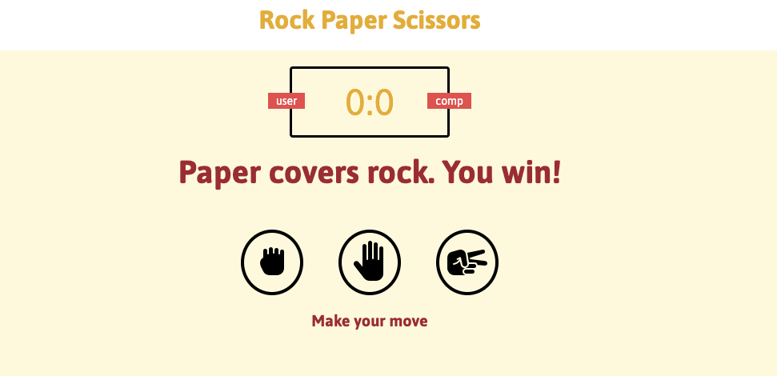

# endOfMod1Project

## Rock Paper Scissors game

Technologies used: 
Html, Javascript, jQuery, CSS

Description:  
Simple two player rock, paper, scissors game.

### Psuedocode:
* 3 seperate functions that will take a winning, losing, and draw conditions.
* function that will keep track of score/display score
* function that will create multiple round~~ still trying to figure that out
* display that will indicate rounds
* display that will indicate winner
* create function that resets score to zero each round
* create round function and then let functions go through it--which functions; the win, lose, draw functions